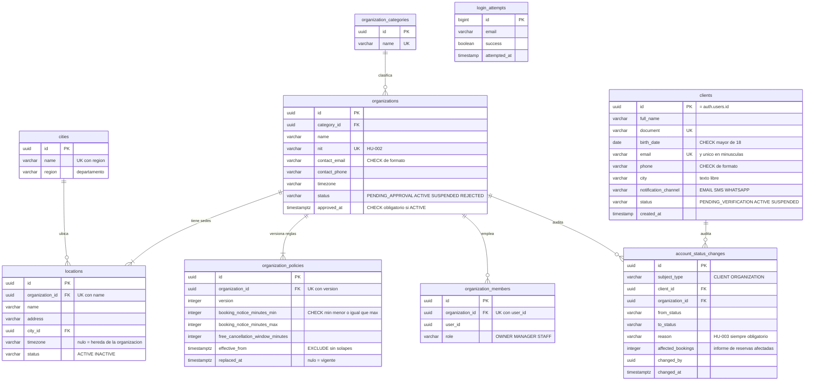
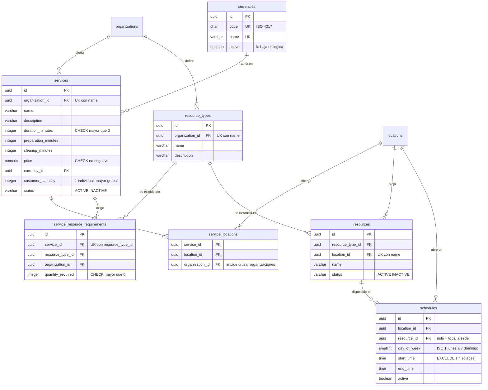
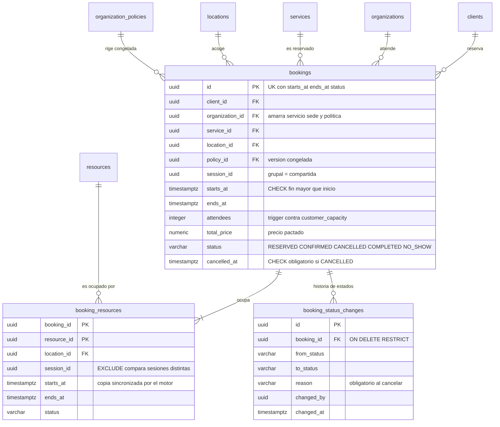
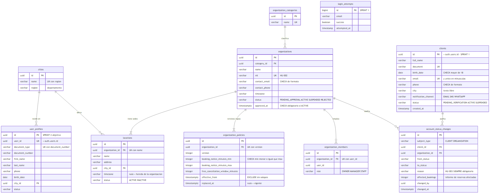
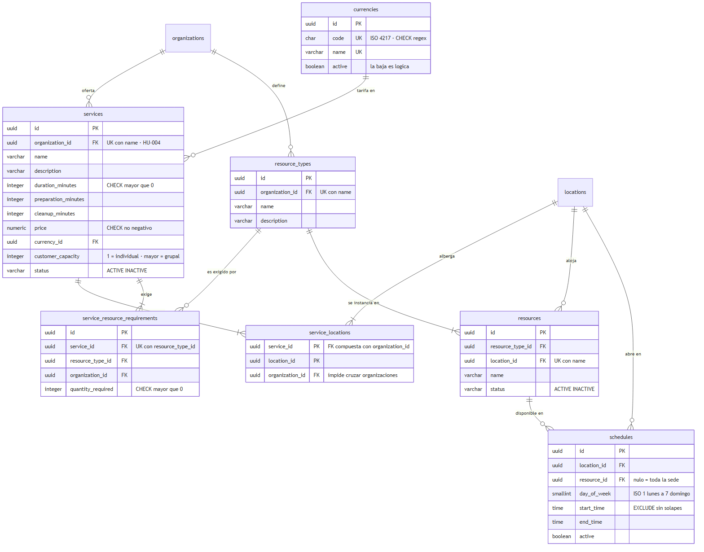
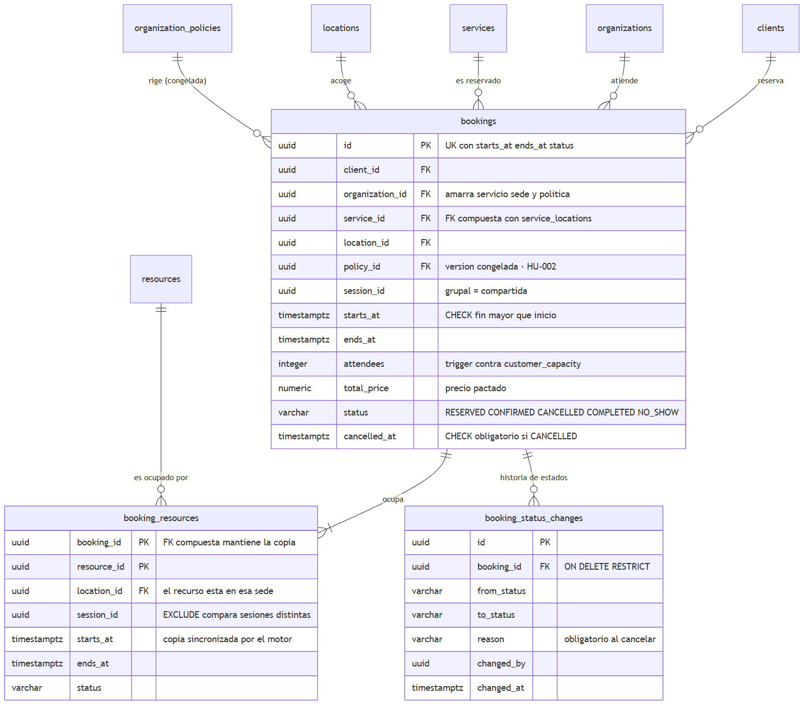

# Plataforma de Reservas de Servicios — Modelo de datos

Sprint 1 · Bases de Datos · CodeF@ctory 2026-II
Anderson Herrera Guzmán · Facultad de Ingeniería, Universidad de Antioquia

Este repositorio tiene el modelo de datos del caso *Plataforma de Reservas de Servicios*.
El backend del equipo está en [`J3rmed/bookingplatform`](https://github.com/J3rmed/bookingplatform).

| Archivo | Qué es |
|---|---|
| [`schema.sql`](schema.sql) | Modelo físico, 19 tablas, ejecutable en PostgreSQL 15+ y Supabase |
| [`seed.sql`](seed.sql) | Datos de prueba |
| [`consultas-clave.sql`](consultas-clave.sql) | Las once preguntas de negocio |
| [`docker-compose.yml`](docker-compose.yml) | Entorno local con PostgreSQL y pgAdmin |
| [`docs/modelo-logico.md`](docs/modelo-logico.md) | Análisis de normalización tabla por tabla |
| [`docs/diagrama-er-v2.drawio`](docs/diagrama-er-v2.drawio) | Diagrama editable |

## Cómo probarlo

```bash
docker compose up -d
```

Levanta PostgreSQL 16 en `localhost:5432` con el esquema y los datos ya cargados, y pgAdmin en
<http://localhost:8080>. Las credenciales están en el `docker-compose.yml`: son de desarrollo local.

El healthcheck del contenedor no mira si el proceso vive, mira si existen las 19 tablas. Si el
servicio queda en `healthy`, el DDL corrió sin errores.

Para correr las consultas:

```bash
docker compose cp consultas-clave.sql postgres:/tmp/
docker compose exec postgres psql -U postgres -d reservas -f /tmp/consultas-clave.sql
```

Para empezar de cero: `docker compose down -v && docker compose up -d`.

## De dónde sale este modelo

No lo inventé de cero. El equipo ya tenía un diagrama de diseño y desarrollo ya había implementado
parte, y las dos cosas no coincidían. Lo que hice fue unirlas y completar lo que faltaba.

| | Qué es | Alcance |
|---|---|---|
| v1.0 | Diagrama de diseño del equipo | 12 entidades, sin reservas |
| v1.5 | Lo que desarrollo implementó en Java | `clients` y `login_attempts` |
| v2.0 | Este modelo | 19 tablas |

**Lo que estaba implementado no se tocó.** `clients` y `login_attempts` se reproducen con los mismos
nombres, tipos y largos que genera el mapeo JPA, incluido el `timestamp(6)` sin zona horaria. El
perfil de nube del equipo arranca con `ddl-auto=validate`, así que cambiar un tipo rompería el
arranque en producción. Lo único que les añadí son restricciones, que Hibernate ignora al validar.

### Correcciones al diagrama de diseño

| Dónde | Decía | Dice |
|---|---|---|
| `OrganizationPolicy.booking_notice_minutes_min` | `INTEGEER` | `integer` |
| `Service.preparation_minutes` | descripción: `TODO` | descrita, más `cleanup_minutes` |
| `ResourceType.organization_id` | "Id del servicio" | "Id de la organización" |
| `Service.currency` | sin sufijo | `currency_id`, es una clave foránea |
| `Service.price` | `INTEGER` | `numeric(12,2)` |
| `Organization` | sin NIT | `nit` único, que HU-002 pide como criterio de aceptación |
| `status` en cuatro tablas | `VARCHAR \| ENUM`, sin decidir | `varchar` con `check` |
| Nota de `ResourceType` | "fungibles y no consumibles" | "no consumibles"; fungible significa consumible |
| `OrganizationMember.user_id → User.id` | pata de gallo invertida | `User (1) → OrganizationMember (N)` |
| `Service → ServiceResourceRequirement` | apuntaba a la clave primaria | apunta a `service_id` |

Ninguna entidad se renombró. La única que saqué es `UserProfile`, porque se solapaba entera con
`clients` y tener dos tablas para la misma persona es una anomalía de actualización; lo explico más
abajo.

Las nuevas son `service_locations`, `resources`, `schedules`, `bookings`, `booking_resources`,
`booking_status_changes` y `account_status_changes`. Sin ellas no se puede responder en qué sede se
presta un servicio, qué recurso queda ocupado, qué horarios hay, ni qué reservas existen.

## Entidades y relaciones

Son 19 tablas. Las partí en tres vistas porque todas juntas quedan ilegibles.

`auth.users` la gestiona Supabase Auth y no se crea en `schema.sql`; por eso `clients.id`,
`organization_members.user_id` y `account_status_changes.changed_by` no tienen clave foránea
declarada.

### Identidad y organización



### Servicios y recursos



### Reservas



<details>
<summary>Los mismos tres diagramas como imagen, por si Mermaid no carga</summary>







</details>

### Las 19 tablas, con sus claves

| Tabla | Clave primaria | Claves foráneas | Para qué |
|---|---|---|---|
| `cities` | `id` | — | Catálogo de ciudades, con departamento |
| `organization_categories` | `id` | — | Catálogo de categorías de negocio |
| `currencies` | `id` | — | Monedas ISO 4217 |
| `clients` | `id` | — (`id` = `auth.users.id`) | Perfil del cliente final (HU-001) |
| `login_attempts` | `id` | — | Intentos de ingreso, para el bloqueo de HU-021 |
| `organizations` | `id` | `category_id` | El negocio proveedor (HU-002) |
| `organization_members` | `id` | `organization_id` | Quién trabaja en qué organización y con qué rol |
| `organization_policies` | `id` | `organization_id` | Reglas de anticipación y cancelación, versionadas |
| `locations` | `id` | `organization_id`, `city_id` | Sedes |
| `services` | `id` | `organization_id`, `currency_id` | Servicios ofertados (HU-004) |
| `service_locations` | `service_id`, `location_id` | `(service_id, organization_id)`, `(location_id, organization_id)` | En qué sedes se presta cada servicio |
| `resource_types` | `id` | `organization_id` | Tipos de recurso no consumible |
| `service_resource_requirements` | `id` | `(service_id, organization_id)`, `(resource_type_id, organization_id)` | Cuántos recursos exige un servicio |
| `resources` | `id` | `resource_type_id`, `location_id` | La instancia concreta que se ocupa |
| `schedules` | `id` | `location_id`, `(resource_id, location_id)` | Franjas semanales de disponibilidad |
| `bookings` | `id` | `client_id`, `(service_id, location_id)`, `(service_id, organization_id)`, `(location_id, organization_id)`, `(policy_id, organization_id)` | La reserva |
| `booking_resources` | `booking_id`, `resource_id` | `(booking_id, starts_at, ends_at, status)`, `(resource_id, location_id)` | Qué recursos ocupa una reserva |
| `booking_status_changes` | `id` | `booking_id` | Historia de estados de una reserva |
| `account_status_changes` | `id` | `client_id`, `organization_id` | Motivo e informe al cambiar el estado de una cuenta (HU-003) |

Las claves foráneas entre paréntesis son compuestas. Son las que impiden que una reserva mezcle
organizaciones, que un recurso se asigne fuera de su sede, y que la copia de `booking_resources` se
desvíe de su reserva.

## Preguntas clave del negocio

Once preguntas. Todas se ejecutan sobre las tablas de `schema.sql` y todas devuelven filas con los
datos de `seed.sql`. El SQL está en [`consultas-clave.sql`](consultas-clave.sql).

| # | Pregunta | Tipo | HU |
|---|---|---|---|
| 1 | ¿Qué servicios puede reservar un cliente en Medellín, en qué sede y a qué precio? | join de 6 tablas, filtros | 002, 004 |
| 2 | ¿Cuál es la ocupación por sede y semana: reservas, asistentes e ingresos? | agregación, `date_trunc` | enunciado |
| 3 | ¿Qué servicios no puede prestar una sede por falta de recursos? | `left join`, `having` | 004 |
| 4 | ¿Cuáles son los servicios más reservados de cada organización, con empates? | `rank()` | enunciado |
| 5 | Si se suspende un proveedor, ¿qué reservas futuras quedan afectadas? | join, subconsulta | 003 |
| 6 | ¿Qué agenda tiene cada recurso y cuánta carga lleva? | `left join`, agregación | 004 |
| 7 | ¿Qué proveedores llevan más tiempo esperando aprobación? | filtro, antigüedad | 003 |
| 8 | ¿Está bloqueada una cuenta por intentos fallidos? | agregación con ventana temporal | 021 |
| 9 | ¿Qué clientes llevan más de 24 h sin verificar el correo? | filtro temporal | 001 |
| 10 | ¿Qué condiciones de cancelación rigen para cada reserva? | join, `case` | 002 |
| 11 | ¿El correo, el documento o el NIT ya están registrados? | `exists` | 001, 002 |

Dos ejemplos con el SQL a la vista. La primera cruza seis tablas y aplica la regla de HU-002 de que
un proveedor pendiente no aparece en el catálogo:

```sql
select o.name as organizacion, s.name as servicio, l.name as sede, s.price, cur.code as moneda
from services s
    inner join organizations     o   on o.id   = s.organization_id
    inner join service_locations sl  on sl.service_id = s.id
    inner join locations         l   on l.id   = sl.location_id
    inner join cities            c   on c.id   = l.city_id
    inner join currencies        cur on cur.id = s.currency_id
where c.name = 'Medellín'
  and s.status = 'ACTIVE' and l.status = 'ACTIVE' and o.status = 'ACTIVE'
order by o.name, s.name;
```

Y la tercera, que detecta servicios publicados en una sede que no tiene recursos para prestarlos:

```sql
select s.name as servicio, l.name as sede, rt.name as tipo_de_recurso,
       srr.quantity_required as requiere, count(r.id) as disponibles
from services s
    inner join service_locations             sl  on sl.service_id = s.id
    inner join locations                     l   on l.id = sl.location_id
    inner join service_resource_requirements srr on srr.service_id = s.id
    inner join resource_types                rt  on rt.id = srr.resource_type_id
    left  join resources                     r   on r.resource_type_id = rt.id
                                                and r.location_id = l.id
                                                and r.status = 'ACTIVE'
group by s.name, l.name, rt.name, srr.quantity_required
having count(r.id) < srr.quantity_required;
```

La 10 es la que mejor muestra el modelo. Dos reservas de la misma barbería salen con ventanas de
cancelación distintas, 1440 y 720 minutos, porque cada una apunta a la versión de política que regía
cuando se creó. Esa regla de HU-002 queda resuelta en el modelo y no en el código.

## Normalización

Las 19 tablas cumplen 3FN; 15 llegan a BCNF. El detalle por tabla, con sus dependencias funcionales,
está en [`docs/modelo-logico.md`](docs/modelo-logico.md). Lo importante:

**Catálogos separados.** `cities`, `organization_categories` y `currencies` salieron como tablas
propias. Sin eso, ciudad, categoría y moneda serían texto repetido, que es justo lo que pasa hoy en
`clients.city`, que es texto libre y donde pueden convivir `'Medellín'` y `'Medellin'` como si
fueran dos ciudades distintas. `locations` sí usa el catálogo.

**Cada dependencia funcional tiene su restricción.** Una dependencia que el diseño supone pero el
esquema no garantiza no existe. Por eso hay 21 `unique` además de las claves primarias.

**Coherencia entre organizaciones.** Antes se podía reservar el servicio de una organización, en la
sede de otra, bajo la política de una tercera. `bookings` lleva `organization_id` y tres claves
foráneas compuestas que lo impiden, más una cuarta contra `service_locations` que impide reservar un
servicio en una sede donde no se presta.

### Las dos redundancias, y por qué están

**`booking_resources` repite `starts_at`, `ends_at` y `status` de `bookings`.** Es una violación de
2FN: `booking_id` es parte de la clave primaria y determina esas tres columnas. Está a propósito,
porque PostgreSQL no evalúa un `EXCLUDE` a través de un join, y para impedir que un recurso se
reserve dos veces en franjas solapadas las columnas tienen que estar en la misma tabla que
`resource_id`.

La diferencia con una redundancia descuidada es que la copia no puede desviarse:

```sql
constraint uk_bookings_snapshot unique (id, starts_at, ends_at, status)

constraint fk_booking_resources_bkg
    foreign key (booking_id, starts_at, ends_at, status)
    references bookings (id, starts_at, ends_at, status)
    on update cascade on delete cascade
```

La mantiene el motor. Mover una reserva o cancelarla propaga solo a la ocupación del recurso, y
desincronizarlas a mano falla con violación de clave foránea.

**`bookings.total_price` guarda el precio pactado.** No es una desnormalización. Como
`services.price` puede cambiar, la dependencia `service_id → total_price` no se cumple en esta
relación: es el precio que el cliente pactó, no una copia del precio de catálogo.

### Una sola tabla de perfil

El diagrama de diseño traía `UserProfile` como generalización de `clients`, pensada para cubrir
también al personal de las organizaciones. Dejé solo `clients`, que es la que está implementada y la
que `bookings` referencia: dos tablas para la misma persona son una anomalía de actualización, y los
datos podrían quedar distintos en cada una.

Del personal de una organización guardo la membresía y el rol en `organization_members`. Sus datos
personales viven en `auth.users` de Supabase, que es donde ya están, así que replicarlos aquí sería
repetir lo que `clients` ya modela para el cliente final.

## Modelo físico

`schema.sql` está escrito a mano. El del repo del equipo documenta solo dos tablas porque está
generado desde el mapeo JPA: es un resultado del código, no la fuente del modelo, y por eso nunca va
a tener claves foráneas ni índices pensados.

Cifras leídas del catálogo de PostgreSQL después de ejecutarlo:

| | Antes | Ahora |
|---|---|---|
| Tablas | 2 | 19 |
| Claves foráneas | 0 | 26 |
| CHECK | 3 | 43 |
| UNIQUE | 2 | 21 |
| EXCLUDE | 0 | 3 |
| Triggers | 0 | 8 |
| Columnas `not null` | 21 | 123 |
| Índices | 3 | 65 |

```sql
select contype, count(*) from pg_constraint
 where connamespace = 'public'::regnamespace group by contype;
```

### Reglas de negocio que garantiza la base

| Regla | Cómo | HU |
|---|---|---|
| NIT único | `uk_organizations_nit` | 002 |
| Anticipación mínima menor o igual que la máxima | `ck_organization_policies_notice` | 002 |
| Una sola política vigente por organización | índice único parcial | 002 |
| Las versiones de política no se solapan | `ex_organization_policies_solape` | 002 |
| No hay organización activa sin fecha de aprobación | `ck_organizations_approved` | 002 |
| Un proveedor pendiente no es reservable | trigger | 002 |
| Nombre de servicio único por proveedor | `uk_services_org_name` | 004 |
| No se reserva un servicio en una sede donde no se presta | `fk_bookings_service_location` | 004 |
| Un recurso no se reserva dos veces en franjas solapadas | `ex_booking_resources_solape` | enunciado |
| Un servicio grupal sí admite varios clientes | `session_id with <>` en ese mismo EXCLUDE | 004 |
| No se supera el aforo | trigger | 004 |
| Un servicio con reservas no se borra | `on delete restrict` | 004 |
| Cambiar la duración no mueve las reservas existentes | `bookings` guarda sus propias horas | 004 |
| Un cliente no verificado no confirma reservas | trigger | 001 |
| No se registran menores de 18 | `ck_clients_adult` | 001 |
| Correo único, también sin distinguir mayúsculas | `uk_clients_email` más índice sobre `lower(email)` | 001 |
| Formato de correo y teléfono | `ck_clients_email_formato`, `ck_clients_phone_formato` | 001 |
| Cancelar exige motivo | `ck_bsc_reason` | 003 |
| Cambiar el estado de una cuenta exige motivo e informe | trigger más `account_status_changes` | 003 |
| El historial no se borra con la reserva | `on delete restrict` | 003 |
| Dos franjas de agenda del mismo recurso no se solapan | `ex_schedules_solape` | enunciado |

### La restricción contra la sobreocupación

El enunciado dice que la falta de herramientas genera sobreocupación. Eso se resuelve así:

```sql
constraint ex_booking_resources_solape exclude using gist (
    resource_id with =,
    session_id  with <>,
    tstzrange(starts_at, ends_at) with &&
) where (status in ('RESERVED', 'CONFIRMED'))
```

Un recurso no puede estar en dos sesiones distintas cuyos rangos se solapen, mientras estén vivas.

El `session_id with <>` es lo que hace posibles los servicios grupales. Sin él, el segundo cliente
que reservara el mismo taller chocaba contra la restricción, porque comparte el salón con el
primero: el modelo declaraba cupos de ocho que su propia restricción prohibía usar.

### Otras decisiones

`uuidv7()` no existe en Supabase, llegó en PostgreSQL 18 y Supabase corre 15 o 17. El diseño los
llama UUIDv7 pero el `default` en base es `gen_random_uuid()`; la aplicación puede generar el v7 y
pasarlo explícitamente.

Las tablas nuevas usan `timestamptz` porque el modelo maneja zona horaria por organización y por
sede. Los estados van como `varchar` con `check` en vez de tipo `enum`, así se leen directo en las
consultas y agregar un valor no obliga a alterar un tipo. Solo se indexan las claves foráneas que no
son ya el prefijo de una `unique`.

## Lo que la base no garantiza

- Que toda reserva ocupe los recursos que su servicio exige. `service_resource_requirements` dice
  cuántos hacen falta, pero nada obliga a insertar las filas en `booking_resources`.
- Que una organización activa tenga al menos una sede, ni que un servicio activo declare sedes y
  tipos de recurso. Son cardinalidades mínimas entre tablas.
- La política de contraseñas, el MFA, las sesiones y los enlaces de un solo uso de HU-021. Viven en
  Supabase Auth, fuera de este esquema.
- El rol de administrador de plataforma. `organization_members.role` modela roles dentro de una
  organización, no el rol global.
- Las excepciones de agenda como festivos o mantenimientos. `schedules` solo modela la franja
  semanal recurrente.

## Dónde está cada criterio de la rúbrica

| Criterio | Dónde |
|---|---|
| Entidades y relaciones | *Entidades y relaciones*, tres diagramas Mermaid, más el `.drawio` |
| Preguntas clave | *Preguntas clave del negocio* y `consultas-clave.sql` |
| Modelo lógico | *Normalización* y `docs/modelo-logico.md` |
| Modelo físico | `schema.sql` y *Modelo físico* |
| Repositorio y documentación | Este README y el historial de commits |
